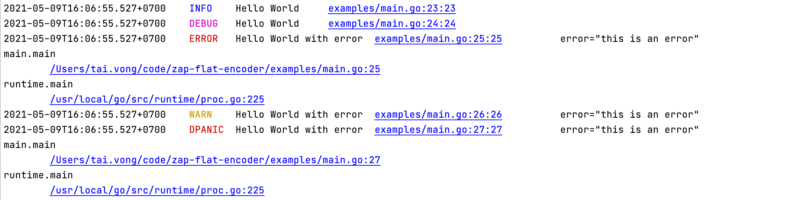

# zap-flat-encoder

A flatten console encoder for Uber Zap

[](http://godoc.org/github.com/vchitai/zap-flat-encoder)
[](http://gocover.io/github.com/vchitai/zap-flat-encoder)
[](https://goreportcard.com/report/github.com/vchitai/zap-flat-encoder)

- With Zap Default Encoder:
```shell
2021-05-09T16:10:13.332+0700	INFO	zap-flat-encoder/encoder_test.go:153	Hello World	{"int": 1, "ints": [1, 2, 3, 4, 5, 6, 7, 8, 9, 0], "string": "a", "strings": ["a", "b", "c", "d", "e", "f", "g", "h", "i", "j"], "time": "1970-01-01T08:00:00.000+0800", "times": ["1970-01-01T08:00:00.000+0800", "1970-01-01T08:00:01.000+0800", "1970-01-01T08:00:02.000+0800", "1970-01-01T08:00:03.000+0800", "1970-01-01T08:00:04.000+0800", "1970-01-01T08:00:05.000+0800", "1970-01-01T08:00:06.000+0800", "1970-01-01T08:00:07.000+0800", "1970-01-01T08:00:08.000+0800", "1970-01-01T08:00:09.000+0800"], "user1": {"name": "Jane Doe", "email": "jane@test.com", "createdAt": 315576000000000000}, "user2": {"name": "Jane Doe", "email": "jane@test.com", "createdAt": 315576000000000000}, "users": [{"name": "Jane Doe", "email": "jane@test.com", "createdAt": 315576000000000000}, {"name": "Jane Doe", "email": "jane@test.com", "createdAt": 315576000000000000}, {"name": "Jane Doe", "email": "jane@test.com", "createdAt": 315576000000000000}, {"name": "Jane Doe", "email": "jane@test.com", "createdAt": 315576000000000000}, {"name": "Jane Doe", "email": "jane@test.com", "createdAt": 315576000000000000}, {"name": "Jane Doe", "email": "jane@test.com", "createdAt": 315576000000000000}, {"name": "Jane Doe", "email": "jane@test.com", "createdAt": 315576000000000000}, {"name": "Jane Doe", "email": "jane@test.com", "createdAt": 315576000000000000}, {"name": "Jane Doe", "email": "jane@test.com", "createdAt": 315576000000000000}, {"name": "Jane Doe", "email": "jane@test.com", "createdAt": 315576000000000000}], "error": "fail"}
```

- With This Encoder:
```shell
2021-05-09T16:10:13.314+0700	INFO	Hello World	zap-flat-encoder/encoder_test.go:152:152		int=1	ints=[1234567890]	string="a"	strings=["a""b""c""d""e""f""g""h""i""j"]	time="1970-01-01T08:00:00.000+0800"	times=["1970-01-01T08:00:00.000+0800""1970-01-01T08:00:01.000+0800""1970-01-01T08:00:02.000+0800""1970-01-01T08:00:03.000+0800""1970-01-01T08:00:04.000+0800""1970-01-01T08:00:05.000+0800""1970-01-01T08:00:06.000+0800""1970-01-01T08:00:07.000+0800""1970-01-01T08:00:08.000+0800""1970-01-01T08:00:09.000+0800"]	user1={	name="Jane Doe"	email="jane@test.com"	createdAt=315576000000000000}	user2={	name="Jane Doe"	email="jane@test.com"	createdAt=315576000000000000}	users=[{	name="Jane Doe"	email="jane@test.com"	createdAt=315576000000000000}{	name="Jane Doe"	email="jane@test.com"	createdAt=315576000000000000}{	name="Jane Doe"	email="jane@test.com"	createdAt=315576000000000000}{	name="Jane Doe"	email="jane@test.com"	createdAt=315576000000000000}{	name="Jane Doe"	email="jane@test.com"	createdAt=315576000000000000}{	name="Jane Doe"	email="jane@test.com"	createdAt=315576000000000000}{	name="Jane Doe"	email="jane@test.com"	createdAt=315576000000000000}{	name="Jane Doe"	email="jane@test.com"	createdAt=315576000000000000}{	name="Jane Doe"	email="jane@test.com"	createdAt=315576000000000000}{	name="Jane Doe"	email="jane@test.com"	createdAt=315576000000000000}]	error="fail"
```

## Examples

See [Example use](/examples)

Usage:

```go
	l, err := zap.Config{
		Encoding:         zapflatencoder.EncoderName,
		EncoderConfig:    zapflatencoder.DefaultConfig,
	}.Build()
	if err != nil {
		log.Fatal("Cannot init logger", err)
	}
	l.Info("Hello World")
	l.Debug("Hello World")
	l.Error("Hello World with error", zap.Error(fmt.Errorf("this is an error")))
	l.Warn("Hello World with error", zap.Error(fmt.Errorf("this is an error")))
	l.DPanic("Hello World with error", zap.Error(fmt.Errorf("this is an error")))
```

Output:



```shell
2021-05-09T15:53:44.388+0700    INFO    Hello World     examples/main.go:23:23
2021-05-09T15:53:44.388+0700    DEBUG   Hello World     examples/main.go:24:24
2021-05-09T15:53:44.388+0700    ERROR   Hello World with error  examples/main.go:25:25          error="this is an error"
main.main
        /Users/tai.vong/code/zap-flat-encoder/examples/main.go:25
runtime.main
        /usr/local/go/src/runtime/proc.go:225
2021-05-09T15:53:44.388+0700    WARN    Hello World with error  examples/main.go:26:26          error="this is an error"
2021-05-09T15:53:44.388+0700    DPANIC  Hello World with error  examples/main.go:27:27          error="this is an error"
main.main
        /Users/tai.vong/code/zap-flat-encoder/examples/main.go:27
runtime.main
        /usr/local/go/src/runtime/proc.go:225
```
